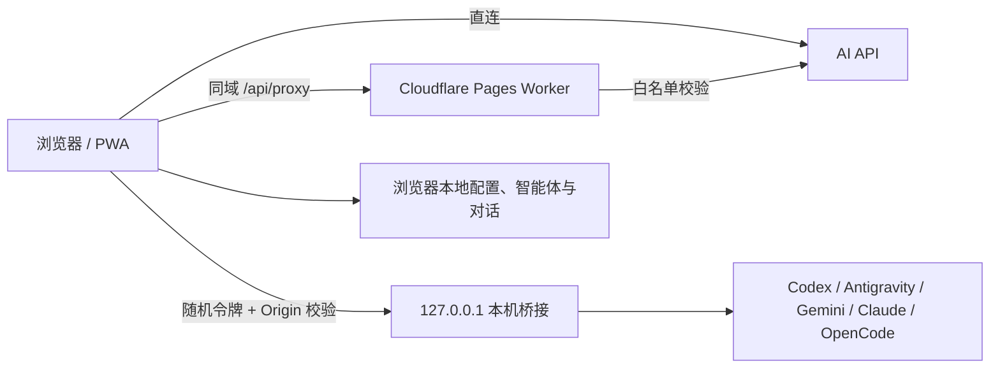

<div align="center">
  
  <h1>AI Shakedown Console</h1>
  <p><strong>在一个干净的网页里，连接、检查并使用你的 AI 模型。</strong></p>
  <p>多协议 API 调试 · 本机 CLI 登录复用 · 智能体库 · 多对话 · PWA</p>
  <p>
    
    
    
    <a href="./LICENSE"></a>
  </p>
  <p>
    <a href="https://ai-shakedown-console.pages.dev/"><strong>在线使用</strong></a>
    · <a href="./docs/USER_GUIDE.md">使用指南</a>
    · <a href="./docs/LOCAL_AI.md">本机 AI</a>
    · <a href="./docs/DEPLOYMENT.md">部署</a>
    · <a href="./docs/TROUBLESHOOTING.md">排查问题</a>
  </p>
</div>

---

AI Shakedown Console 是一个无需构建步骤的多协议 AI 工作台。它既能直接连接 OpenAI Compatible、Anthropic 和 Gemini API，也能通过安全的本机桥接复用已经登录的 Codex、Antigravity、Gemini CLI、Claude Code 与 OpenCode。

`v26` 是当前稳定版本：在 v25 的完整聊天与多模态能力上，修复了窄窗口/PWA 中输入区未贴底的问题，将 System 收起为弹窗编辑，并增加默认不污染 Codex 最近任务的临时线程和可携带附件的跨设备完整对话备份。

## 为什么使用它

| 你想做的事 | AI Shakedown Console 提供的能力 |
| --- | --- |
| 快速验证 API | 地址、密钥、模型、请求体、SSE 流和错误信息集中在一个页面 |
| 连接不同厂商 | OpenAI Compatible、Anthropic Messages、Google Gemini 三类协议 |
| 使用本机登录 | 复用 5 种本机 CLI 的现有登录，不把 CLI 凭据复制到网页 |
| 管理长期对话 | 多对话、自动恢复、编辑分支、搜索、复制、完整备份和失败重试 |
| 发送本地文件 | 支持图片、文本/代码和可提取文字的 PDF；仅在模型通过图片探测后显示入口 |
| 使用专业角色 | 268 个内置中文智能体，并支持自建 System 智能体 |
| 像桌面应用运行 | 可安装 PWA，独立窗口启动并离线打开应用外壳 |
| 排查连接问题 | 脱敏请求检查器、连接测试、模型列表和清晰的错误提示 |

## 三分钟开始

1. 打开 [在线版本](https://ai-shakedown-console.pages.dev/)。
2. 在左侧选择服务商，填写 API Key 和模型；本机工具则选择对应的“本机登录”预设。
3. 点击“检查连接”。成功后页面自动收起设置，进入专注聊天。
4. 输入消息，macOS 使用 `⌘ + Enter` 发送，Windows/Linux 使用 `Ctrl + Enter` 发送；普通 `Enter` 保留换行。

> 中文输入法组词和选择候选词时不会触发快捷发送。消息框右上角的 `?` 会根据当前系统显示完整操作帮助。

第一次使用本机 Codex 等工具？请直接阅读 [本机 AI 连接指南](./docs/LOCAL_AI.md)，其中包含 macOS 权限提示、完整命令、Node.js 检查、后台运行、更新、停止和端口冲突处理。

## 核心能力

- **多协议连接**：内置主流服务商预设，也支持自定义 Base URL、路径、认证、请求头和附加 JSON 参数。
- **专注聊天**：连接成功后隐藏配置和检查器；对话超过 4 个后自动切换为持久化左侧列表。
- **贴底输入区**：消息区随窗口弹性伸缩，输入框在浏览器和 PWA 窄窗口中都始终停在底部。
- **完整消息操作**：单条复制、编辑并重发、自动分支、重新生成、继续生成、从此处删除；支持多选复制、导出和删除。
- **按能力显示附件**：检查连接时发送 16×16 测试图片；只有当前协议、地址和模型实际接受图片时才显示附件按钮，避免给纯文本模型展示无效入口。
- **本地附件处理**：图片按三种协议映射为多模态输入；文本/代码直接读取；PDF 使用自托管 PDF.js 在浏览器本地提取文字。附件草稿和历史文件保存在 IndexedDB。
- **智能体与 System**：内置与自定义智能体统一管理；聊天区只显示 System 状态，点击“编辑”在弹窗中修改，避免提示词长期占用输入空间。
- **本地记录导入**：支持 Codex、Gemini CLI、Claude Code 及通用 JSON/JSONL 文件，可继续使用当前模型对话。
- **跨设备完整备份**：设置中可一次导出全部对话、System、智能体状态、草稿和附件，在另一台电脑追加恢复；同一备份重复导入不会生成副本。
- **本机 CLI 桥接**：启动器自动检查环境、停止同工具旧桥接、避开被占端口并转入后台；当前 PWA 自动连接，不重复打开网页。
- **安全 Markdown**：使用 Marked 解析 GitHub Flavored Markdown，再由 DOMPurify 清洗后显示。
- **PWA 与离线外壳**：可安装到桌面或主屏幕；离线时仍能打开页面和查看浏览器本地数据。
- **Cloudflare Pages Worker**：同域代理只允许访问 `ALLOWED_UPSTREAMS` 白名单，避免成为开放代理。

## 支持范围

### API 协议

| 协议 | 代表服务 | 流式响应 |
| --- | --- | :---: |
| OpenAI Compatible | OpenAI、DeepSeek、千问、豆包、Kimi、OpenRouter、Ollama、LM Studio 等 | ✓ |
| Anthropic Messages | Anthropic 原生 `/v1/messages` | ✓ |
| Google Gemini | `generateContent` / `streamGenerateContent` | ✓ |

### 本机登录工具

| 工具 | 调用方式 | 安全约束 |
| --- | --- | --- |
| Codex | 官方 App Server，保持连续线程 | 默认临时任务；可选保存到 Codex；`read-only` 沙盒、`never` 审批 |
| Antigravity | `agy -p` 单轮调用并重放上下文 | 独立临时目录与对话安全指令，Beta |
| Gemini CLI | 无头 JSON 模式 | `plan` 审批模式 |
| Claude Code | Print/JSON 模式 | 禁用内置与 MCP 工具，计划模式 |
| OpenCode | JSON 模式 | 运行时注入 `permission: deny` |

## 工作方式



远程 API、Cloudflare 代理和本机 CLI 是三条独立连接路径。PWA 只负责安装、缓存应用外壳和独立窗口，不会把远程模型变成本地模型。

## 文档中心

| 文档 | 适合谁 | 内容 |
| --- | --- | --- |
| [文档首页](./docs/README.md) | 所有人 | 按任务选择正确文档 |
| [使用指南](./docs/USER_GUIDE.md) | 普通用户 | 连接、聊天、智能体、导入、PWA、快捷键 |
| [本机 AI 指南](./docs/LOCAL_AI.md) | 本机 CLI 用户 | 三系统启动、权限、后台、更新与安全边界 |
| [故障排查](./docs/TROUBLESHOOTING.md) | 遇到错误的用户 | 中文输入、Node、端口、权限、CORS、缓存等 |
| [部署与发布](./docs/DEPLOYMENT.md) | 部署者 | Cloudflare Pages、环境变量、ZIP 和发布检查 |
| [架构说明](./docs/ARCHITECTURE.md) | 维护者 | 模块、数据流、协议适配、存储与缓存 |
| [安全策略](./SECURITY.md) | 用户与维护者 | 凭据、本机桥接、代理边界和漏洞报告 |
| [贡献指南](./CONTRIBUTING.md) | 贡献者 | 修改规范、检查清单和 PR 流程 |
| [版本记录](./CHANGELOG.md) | 所有人 | 重要版本与迁移说明 |

## 本地运行

这是纯 HTML/CSS/JavaScript 项目。因为入口使用 ES Module，请通过 HTTP 服务打开：

```bash
python3 -m http.server 4173
```

然后访问 `http://localhost:4173/`。没有 Python 时，macOS 可使用：

```bash
ruby -run -e httpd . -p 4173 -b 127.0.0.1
```

普通静态服务器不会执行 `_worker.js`，本地调试时请关闭“使用同域代理”。完整说明见 [部署与发布](./docs/DEPLOYMENT.md)。

## 数据与安全

- 配置、API Key、自定义智能体、对话和附件元数据保存在当前站点的 `localStorage`；附件内容保存在同源 `IndexedDB`。只应在可信部署和个人设备上使用。
- “完整备份”只包含对话相关数据和附件，不包含 API Key、连接配置或本机登录；备份 JSON 没有加密，应像私人对话和原文件一样妥善保管。
- 本机桥接配对令牌只保存在当前标签页的 `sessionStorage`，桥接仅监听 `127.0.0.1` 并检查网页 Origin。
- 同域代理只转发到 `ALLOWED_UPSTREAMS` 中列出的上游，不会把密钥写入 Worker 配置。
- 共享设备使用完毕后，请在设置中点击“清除全部本地数据”。

更完整的威胁边界和安全建议见 [SECURITY.md](./SECURITY.md)。

## 项目结构

```text
index.html / style.css / script.js   网页界面与全部前端逻辑
_worker.js                           Cloudflare Pages Worker 与同域代理
assets/                              PWA、本机桥接和三系统启动器
agents/                              268 个中文智能体索引与正文
vendor/                              固定版本的前端依赖与许可证
docs/                                用户、部署、排查和架构文档
scripts/                             智能体角色库导入工具
```

## 项目状态

`v26` 已完成计划中的网页版本：多协议与多模态连接、本机登录工具、完整聊天操作、多对话、智能体、附件、跨设备备份、帮助、PWA、后台桥接、中文输入兼容和稳定的贴底编辑器均已落地。

暂不纳入本版本的方向包括：包含连接配置的加密整站迁移、账号云同步、自动化端到端回归，以及由 Tauri 管理本机进程的原生桌面版。详见 [架构说明中的演进边界](./docs/ARCHITECTURE.md#演进边界)。

## 第三方组件

| 组件 | 版本 | 许可证 | 用途 |
| --- | --- | --- | --- |
| [Marked](https://marked.js.org/) | 15.0.12 | MIT | Markdown 解析 |
| [DOMPurify](https://github.com/cure53/DOMPurify) | 3.2.6 | Apache-2.0 OR MPL-2.0 | HTML 清洗 |
| [Bootstrap Icons](https://icons.getbootstrap.com/) | 1.11.3 | MIT | 界面图标 |
| [PDF.js](https://mozilla.github.io/pdf.js/) | 5.4.296 | Apache-2.0 | 浏览器本地提取 PDF 文字 |
| [agency-agents-zh](https://github.com/jnMetaCode/agency-agents-zh) | 1.2.7 | MIT | 268 个中文智能体 |

依赖全部自托管，不从第三方 CDN 加载。完整许可文本保存在 `vendor/` 与 `agents/` 对应目录。

## 许可证

项目使用 [MIT License](./LICENSE)，Copyright © 2026 ForceMind。

<div align="center">
  <sub>把连接问题留在检查器里，把注意力留给对话本身。</sub>
</div>
