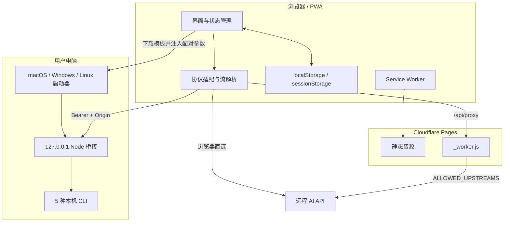

# 架构说明

AI Shakedown Console 以“浏览器优先、无需构建、按需增加受限服务端能力”为核心。所有前端源文件可直接部署，Cloudflare Worker 和本机桥接分别解决跨域与本机登录复用问题。

## 系统边界

## 主要模块

### `index.html`

单页应用结构，包括：

- 页头运行上下文；
- 设置/对话左侧区域；
- 聊天、System Prompt 与消息输入；
- 智能体、自定义智能体、本地导入和帮助弹窗；
- PWA 元数据和固定版本资源入口。

### `style.css`

完整响应式布局，无预处理器。桌面端使用可收缩双栏，移动端把左侧区域变成抽屉。版本号位于左上角品牌副标题下方，不参与操作层布局。

### `script.js`

前端业务核心，主要职责：

- 服务商预设、协议和请求体适配；
- OpenAI/Anthropic/Gemini 流式与非流式响应归一化；
- 配置、智能体、对话和统计状态；
- 本地记录导入；
- 本机启动器生成、配对与控制；
- PWA 安装和更新提示；
- 专注聊天布局与环境帮助；
- 中文输入法组合状态保护。

项目刻意保持单文件前端核心，便于无构建部署；新增大型能力前应评估是否需要在不引入构建链的前提下拆成原生 ES Modules。

### `_worker.js`

Cloudflare Pages Advanced Mode Worker：

- `GET /api/status`：返回应用/Worker 版本与绑定状态；
- `GET|POST /api/proxy`：校验目标上游、过滤请求/响应头并流式转发；
- 其他路径：交给 `env.ASSETS`，并按资源类型设置缓存头。

代理限制包括 HTTPS-only、Origin 白名单、2 MiB 请求上限、禁止 URL 凭据、禁止自动重定向和受控查询 Key 转发。

### `assets/local-codex-bridge.mjs`

本机 Node HTTP 服务，对网页暴露统一的 OpenAI-compatible 接口：

| 接口 | 用途 |
| --- | --- |
| `GET /status` | CLI、桥接版本和账号状态 |
| `GET /v1/models` | 读取或合成模型列表 |
| `POST /v1/chat/completions` | 流式/非流式对话 |
| `POST /shutdown` | 安全停止当前桥接 |

Codex 使用 App Server JSON-RPC 并保留线程；其他 CLI 使用非交互单轮调用，桥接重放网页对话维持上下文。

### 三系统启动器

`assets/launch-codex-macos.command`、`launch-codex-linux.sh` 和 `launch-codex-windows.ps1` 是参数化模板。下载时前端注入：

- 当前版本和桥接 URL；
- 返回页面 Origin；
- 本机工具与 CLI 命令；
- 随机端口起点；
- 随机配对令牌。

启动器负责环境检查、下载桥接、识别旧进程、选择空闲端口、后台启动和重新打开配对页面。

### PWA

`assets/manifest.webmanifest` 定义安装信息与图标。`assets/service-worker.js`：

- 安装时缓存应用外壳；
- 导航使用 network-first，离线回退到入口；
- 同源静态资源使用 cache-first；
- 绕过所有 `/api/` 请求；
- 新版本激活时删除旧项目缓存。

## 协议适配

前端把统一的内部消息结构映射到三类请求：

| 内部字段 | OpenAI | Anthropic | Gemini |
| --- | --- | --- | --- |
| System | `messages[role=system]` | 顶层 `system` | `systemInstruction` |
| 消息 | `messages` | 排除 system 的 `messages` | `contents[].parts[]` |
| 最大输出 | `max_tokens` | `max_tokens` | `generationConfig.maxOutputTokens` |
| Top P/K | `top_p` / `top_k` | `top_p` / `top_k` | `topP` / `topK` |
| 流式 | SSE chat chunks | Anthropic SSE events | Gemini SSE payloads |

响应在进入 UI 前归一化为文本增量、完整文本和 usage。流式期间按纯文本更新，结束后统一经过 Marked 与 DOMPurify 渲染。

## 浏览器数据模型

| Key | 存储 | 内容 |
| --- | --- | --- |
| `ai-shakedown-console.settings.v1` | localStorage | 当前连接和生成设置 |
| `ai-shakedown-console.profiles.v1` | localStorage | 命名配置 |
| `ai-shakedown-console.prompts.v1` | localStorage | 自定义智能体/旧提示词 |
| `ai-shakedown-console.conversations.v1` | localStorage | 对话、消息、System 和激活项 |
| `ai-shakedown-console.conversation-sidebar.v1` | localStorage | 左侧列表偏好 |
| `ai-shakedown-console.help-intro.v1` | localStorage | 首次帮助状态 |
| `ai-shakedown-console.local-codex.v1` | sessionStorage | 本机工具、端口和配对令牌 |

当前数据结构没有云同步、加密或账号隔离。改变现有 key/schema 时必须提供向后兼容读取或清晰迁移说明。

## 智能体资源

`agents/index.json` 保存轻量元数据，角色正文按需从 `agents/content/**/*.md` 加载，避免首屏加载全部文本。导入脚本从上游 frontmatter 生成稳定索引并复制许可证。

## 安全设计

### 浏览器侧

- Markdown 输出先解析后清洗；
- 检查器显示时脱敏认证头和查询 Key；
- 本机配对令牌不持久化到 localStorage；
- 用户可一键清除项目浏览器数据。

### Worker 侧

- 显式上游 Origin 白名单；
- 只允许 HTTPS；
- 过滤 hop-by-hop、Cloudflare 和浏览器安全头；
- 不跟随重定向；
- 不保存 API Key。

### 本机侧

- 只绑定 `127.0.0.1`；
- Bearer 令牌与 Origin 双重检查；
- 只停止可确认归属的桥接进程；
- 使用临时工作目录和各 CLI 可用的最小权限模式；
- 不读取 CLI 认证文件。

完整说明见 [安全策略](../SECURITY.md)。

## 依赖策略

运行时依赖固定版本并存放在 `vendor/`，避免 CDN 可用性和供应链漂移。更新依赖时必须同步许可证、版本表和发布包。

## 演进边界

### 适合继续在当前架构内实现

- 新的 OpenAI-compatible 服务商预设；
- 新的本地记录解析器；
- 新的安全 CLI 无头适配；
- 可选的数据导出/导入；
- 可重复的浏览器回归测试。

### 更适合独立桌面层

- 系统钥匙串；
- 原生进程生命周期管理；
- 自动更新、签名与公证；
- 深度文件系统访问；
- 跨平台系统托盘与崩溃日志。

若启动桌面版，优先考虑 Tauri，并复用当前网页 UI 与数据结构；桌面进程不应扩大网页默认权限。

[返回文档中心](./README.md) · [部署与发布](./DEPLOYMENT.md) · [返回项目首页](../README.md)
