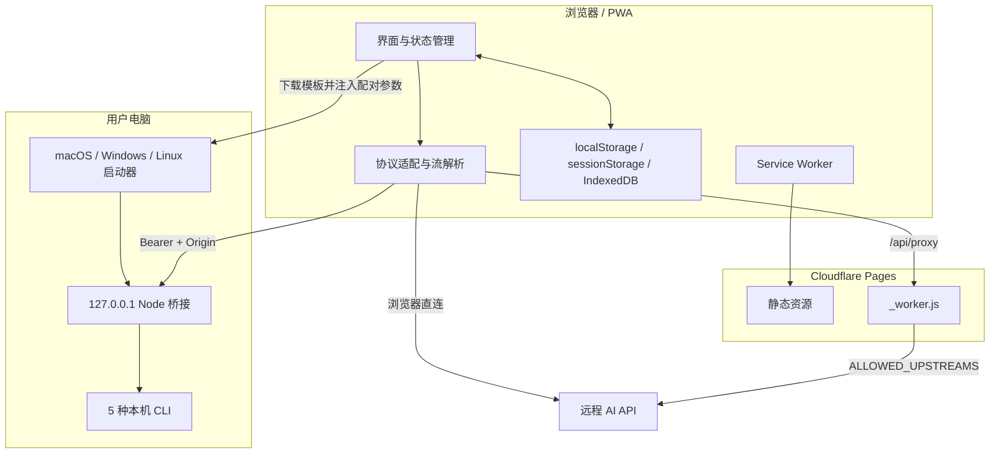

# 架构说明

AI Shakedown Console 以“浏览器优先、无需构建、按需增加受限服务端能力”为核心。所有前端源文件可直接部署，Cloudflare Worker 和本机桥接分别解决跨域与本机登录复用问题。

## 系统边界

## 主要模块

### `index.html`

单页应用结构，包括：

- 页头运行上下文；
- 设置/对话左侧区域；
- 聊天、System Prompt 与消息输入；
- 智能体、自定义智能体、本地导入和帮助弹窗；
- PWA 元数据和固定版本资源入口。

### `style.css`

完整响应式布局，无预处理器。桌面端使用可收缩双栏，移动端把左侧区域变成抽屉。聊天面板为六个显式网格行，消息区固定占用弹性行、输入区固定占用最后一行；搜索或多选工具条隐藏时不会改变它们的位置。

### `script.js`

前端业务核心，主要职责：

- 服务商预设、协议和请求体适配；
- OpenAI/Anthropic/Gemini 流式与非流式响应归一化；
- 配置、智能体、对话和统计状态；
- 稳定消息 ID、编辑分支、选择、搜索、复制、导出、重试与重新生成；
- 图片/文本/PDF 附件处理、IndexedDB 持久化和多模态能力探测；
- 本地记录导入，以及全部对话/附件的备份与追加恢复；
- 本机启动器生成、配对与控制；
- PWA 安装和更新提示；
- 专注聊天布局与环境帮助；
- 中文输入法组合状态保护。

项目刻意保持单文件前端核心，便于无构建部署；新增大型能力前应评估是否需要在不引入构建链的前提下拆成原生 ES Modules。

### `_worker.js`

Cloudflare Pages Advanced Mode Worker：

- `GET /api/status`：返回应用/Worker 版本与绑定状态；
- `GET|POST /api/proxy`：校验目标上游、过滤请求/响应头并流式转发；
- 其他路径：交给 `env.ASSETS`，并按资源类型设置缓存头。

代理限制包括 HTTPS-only、Origin 白名单、20 MiB 完整请求上限、禁止 URL 凭据、禁止自动重定向和受控查询 Key 转发。Worker 会读取请求体复核实际字节数；前端也会在发送前检查序列化 JSON，避免 base64 和历史附件累积超过同一上限。

### `assets/local-codex-bridge.mjs`

本机 Node HTTP 服务，对网页暴露统一的 OpenAI-compatible 接口：

| 接口 | 用途 |
| --- | --- |
| `GET /status` | CLI、桥接版本和账号状态 |
| `GET /v1/models` | 读取或合成模型列表 |
| `POST /v1/chat/completions` | 流式/非流式对话 |
| `POST /shutdown` | 安全停止当前桥接 |

Codex 使用 App Server JSON-RPC 并保留线程。网页默认发送 `X-AI-Shakedown-Codex-History: ephemeral`，桥接在 `thread/start` 设置 `ephemeral: true`，避免网页对话物化为 Codex 最近任务；用户主动开启“同时保存到 Codex”后才改为 `ephemeral: false`。线程内存键同时包含保存模式，切换开关会创建隔离的新线程。其他 CLI 使用非交互单轮调用，桥接重放网页对话维持上下文。

### 三系统启动器

`assets/launch-codex-macos.command`、`launch-codex-linux.sh` 和 `launch-codex-windows.ps1` 是参数化模板。下载时前端注入：

- 当前版本和桥接 URL；
- 返回页面 Origin；
- 本机工具与 CLI 命令；
- 随机端口起点；
- 随机配对令牌。

启动器负责环境检查、下载桥接、识别旧进程、选择空闲端口和后台启动。页面在限定的 100 个候选端口中使用随机挑战寻找桥接；只有响应提供与候选端口绑定的正确 HMAC 证明后，页面才发送当前随机令牌，因此被无关服务占用的端口不会收到配对秘密。桥接等待现有客户端连接，只有没有客户端时才唤起已安装应用或回退到默认浏览器，从而避免重复窗口。

### PWA

`assets/manifest.webmanifest` 定义安装信息与图标。`assets/service-worker.js`：

- 安装时缓存应用外壳；
- 导航使用 network-first，离线回退到入口；
- 同源静态资源使用 cache-first；
- 绕过所有 `/api/` 请求；
- 新版本激活时删除旧项目缓存。

公开版本仍为 `v26` 时，内部缓存可使用 `v26-rN` 修订号。Service Worker 注册使用 `updateViaCache: "none"` 并主动检查更新，避免浏览器或已安装 PWA 在同版本候选包之间继续复用旧脚本；这类修订不会改变页面显示版本或发布 ZIP 名称。

#### macOS App Shim 与输入法边界

Edge/Chrome 在 macOS 安装 PWA 时，还会生成一个独立的原生 App Shim。它负责作为 macOS 应用启动，再连接对应浏览器框架；因此“普通标签页”和“已安装 PWA”拥有不同的原生应用身份、进程与文本输入上下文。

输入法候选窗属于 macOS 原生 UI，不由 DOM 或 Service Worker 绘制。页面只能在输入法开始组合后接收 `compositionstart`、`compositionupdate`、`compositionend` 等事件：

- 候选窗已经出现，但 `Enter` 被误当成发送，属于前端组合事件处理范围；
- 拼音按键已输入，但候选窗完全不出现，首先属于 App Shim、macOS 文本服务或输入法的原生边界；
- 重新安装 Edge PWA 会重建 App Shim、应用登记和文本输入上下文，但浏览器更新后可能复发，也不等同于发布新的网页资源；macOS 第三方输入法的长期方案是 Safari“添加到程序坞”。

这个边界用于避免把原生候选窗故障误判为缓存问题并反复提高网页版本。详细恢复流程见 [故障排查](./TROUBLESHOOTING.md#edge-pwa-输入拼音但没有候选窗)。

## 协议适配

前端把统一的内部消息结构映射到三类请求：

| 内部字段 | OpenAI | Anthropic | Gemini |
| --- | --- | --- | --- |
| System | `messages[role=system]` | 顶层 `system` | `systemInstruction` |
| 消息 | `messages` | 排除 system 的 `messages` | `contents[].parts[]` |
| 图片 | `image_url` data URL | base64 `image` block | `inlineData` |
| 最大输出 | `max_tokens` | `max_tokens` | `generationConfig.maxOutputTokens` |
| Top P/K | `top_p` / `top_k` | `top_p` / `top_k` | `topP` / `topK` |
| 流式 | SSE chat chunks | Anthropic SSE events | Gemini SSE payloads |

响应在进入 UI 前归一化为文本增量、完整文本和 usage。流式期间按纯文本更新，结束后统一经过 Marked 与 DOMPurify 渲染。

### 多模态能力检查

附件入口不根据模型名称猜测。能力签名由服务商、协议、Base URL、请求路径、模型和代理开关组成；用户点击“检查连接”时，前端发送一张内置 16×16 PNG 和最多 2 个输出 Token 的请求：

- 成功：缓存为 `supported` 并显示附件按钮；
- 上游以 400/415/422 明确拒绝 image/vision/multimodal 内容：缓存为 `unsupported`，连接仍可用于文本；
- 认证、网络、限流或其他未知错误：连接检查失败，不把配置误判成纯文本模型。

本机 CLI 桥接尚未开放图片输入，因此始终隐藏附件按钮。每次真正发送消息前会从 IndexedDB 取回附件；图片临时转为 base64，文本/PDF 作为带文件名的文本段加入内容。检查器通过结构化副本隐藏长 base64，不修改实际请求。

### 消息与分支

持久化消息使用 `{id, role, content, attachments, createdAt, status?, error?}`。旧版 `{role, content}` 会在读取时补全稳定 ID 和时间。编辑或重新生成存在后续用户消息的旧轮次时，会复制截断前的历史创建新对话，并记录 `parentConversationId` 与 `branchAtMessageId`；原对话不变。

## 浏览器数据模型

| Key | 存储 | 内容 |
| --- | --- | --- |
| `ai-shakedown-console.settings.v1` | localStorage | 当前连接和生成设置 |
| `ai-shakedown-console.profiles.v1` | localStorage | 命名配置 |
| `ai-shakedown-console.prompts.v1` | localStorage | 自定义智能体/旧提示词 |
| `ai-shakedown-console.conversations.v1` | localStorage | 对话、消息、System 和激活项 |
| `ai-shakedown-console.conversation-sidebar.v1` | localStorage | 左侧列表偏好 |
| `ai-shakedown-console.help-intro.v1` | localStorage | 首次帮助状态 |
| `ai-shakedown-console.pwa-ime-notice.v1` | localStorage | Edge PWA 输入法长期方案提示版本 |
| `ai-shakedown-console.multimodal-capabilities.v1` | localStorage | 按配置签名缓存的多模态检查结果 |
| `ai-shakedown-console.local-codex.v1` | sessionStorage | 本机工具、端口和配对令牌 |
| `ai-shakedown-console.attachments.v1` | IndexedDB | 图片 Blob、文本内容和 PDF 提取文字 |

当前数据结构没有云同步、加密或账号隔离。改变现有 key/schema 时必须提供向后兼容读取或清晰迁移说明。

### 完整对话备份格式

前端导出的 JSON envelope 使用 `format: "ai-shakedown-console-chat-backup"` 和 `formatVersion: 1`。主体包含 `backupId`、激活对话、全部对话快照和被引用附件：图片使用 base64，文本/PDF 使用 UTF-8 字符串。连接设置、API Key、配置库、自定义智能体库和本机配对信息不进入备份。

导入按 `backupId + 源对话 ID + 索引` 生成稳定来源键，用于阻止同一文件重复导入；对话、消息和附件 ID 全部重新生成，分支父项与附件引用同步重映射。数据先写 IndexedDB，再追加 localStorage 对话；任一步失败会回滚本次新增附件与内存状态。导入只追加，不覆盖目标浏览器已有数据。

## 智能体资源

`agents/index.json` 保存轻量元数据，角色正文按需从 `agents/content/**/*.md` 加载，避免首屏加载全部文本。导入脚本从上游 frontmatter 生成稳定索引并复制许可证。

## 安全设计

### 浏览器侧

- Markdown 输出先解析后清洗；
- 检查器显示时脱敏认证头和查询 Key；
- 检查器隐藏图片 base64；附件只在用户选择并发送时进入对应模型请求；
- 完整备份排除 API Key、连接配置和本机配对令牌，但文件自身不加密并可能包含完整对话与附件；
- 本机配对令牌不持久化到 localStorage；
- 用户可一键清除项目浏览器数据。

### Worker 侧

- 显式上游 Origin 白名单；
- 只允许 HTTPS；
- 过滤 hop-by-hop、Cloudflare 和浏览器安全头；
- 不跟随重定向；
- 不保存 API Key。

### 本机侧

- 只绑定 `127.0.0.1`；
- Bearer 令牌与 Origin 双重检查；
- 只停止可确认归属的桥接进程；
- 使用临时工作目录和各 CLI 可用的最小权限模式；
- 不读取 CLI 认证文件。

完整说明见 [安全策略](../SECURITY.md)。

## 依赖策略

运行时依赖固定版本并存放在 `vendor/`，避免 CDN 可用性和供应链漂移。更新依赖时必须同步许可证、版本表和发布包。

## 演进边界

### 适合继续在当前架构内实现

- 新的 OpenAI-compatible 服务商预设；
- 新的本地记录解析器；
- 新的安全 CLI 无头适配；
- 加密的整站迁移包和可选云同步；
- 可重复的浏览器回归测试。

### 更适合独立桌面层

- 系统钥匙串；
- 原生进程生命周期管理；
- 自动更新、签名与公证；
- 深度文件系统访问；
- 跨平台系统托盘与崩溃日志。

若启动桌面版，优先考虑 Tauri，并复用当前网页 UI 与数据结构；桌面进程不应扩大网页默认权限。

[返回文档中心](./README.md) · [部署与发布](./DEPLOYMENT.md) · [返回项目首页](../README.md)
